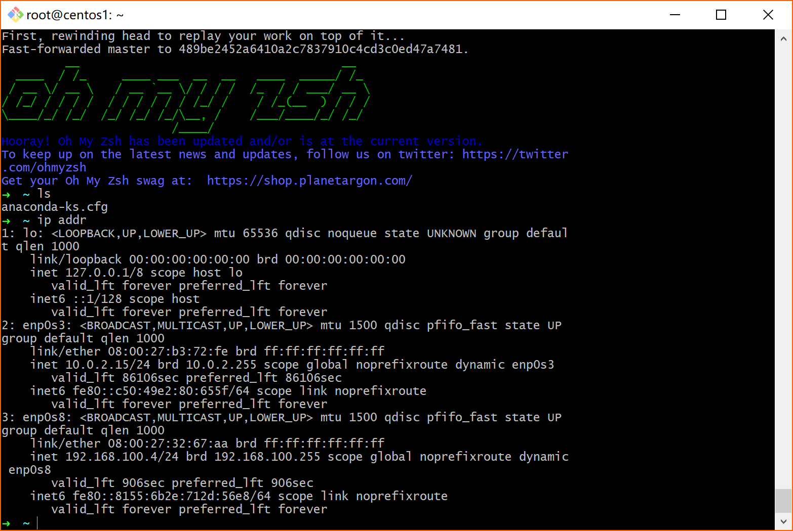

# 关于使用VirtualBox搭建本地私有云

`2018-09-10`

## 前言

首先我先表明自己的观点，博客的质量与其篇章长度、图片数量、事无巨细的表述没有必然联系。

课程博客我一般分两种。一种是笔记型的，属于自己把课程作业的流程记录下来为主，也顺便帮其他同学跳坑；另一种是分享型的，一般是把自己获得的新知识或别人可能接触得比较少的知识给列出来，开阔新视界。至于那种自己的创新技术或研发的新型框架等内容，单独分出来吧，这时候博客只是一种叙述形式，github开源代码、发paper也是好的形式，当然这对于课程而言要求就高了点了。

## VirtualBox搭建私有云

大家都是按照老师给的教程一步步做下去，如果有相关知识基础的同学基本问题不大，而出问题的同学一般都是忽略了某些步骤并且并不知道某些步骤的作用是什么。

我就不像大部分同学那样把整个搭建流程一步步列出来了，没什么营养。网上很多详细的教程，也有写得非常精细的同学，在这里表示下敬佩。

我主要是对照着老师提供的实验内容步骤，稍微聊几句自己知道的东西和自己疑惑的东西，有兴趣的同学可以去了解，没兴趣略过即可。

### 课程要求

[使用 VirtualBox 让 PC 提供云桌面服务](https://pmlpml.github.io/ServiceComputingOnCloud/ex-install-cloud)

### 云计算与虚拟化

上过《云计算概论》这门课的同学应该对这些概念不陌生，浅层知识的话《云计算 概念、技术与架构》  这本书足够了。

现在的民用硬件虚拟化基本只有俩，AMD-V 或 Intel-VT 。

这里有一个要注意的点就是，不在开机进主板BIOS的时候把虚拟化选项开启的话，在建立虚拟机的时候很可能会发现没有创建64位操作系统的选项。至于原理，就是硬件虚拟化相关的内容了，这里展开讲的话很冗长，查一下就有。

可以看看这个[参考链接](https://superuser.com/questions/866962/why-does-virtualbox-only-have-32-bit-option-no-64-bit-option-on-windows-7)。

### 远程访问

别以为这只是连个ssh或者QQ上点个远程协助或者teamviewer连一下宿舍电脑传个画面这么简单，这个其实是一个大方向，关联到的技术很复杂，足够当做一个长期研究的方向了。

首先是[ssh](https://zh.wikipedia.org/wiki/Secure_Shell)，其实就是个网络传输用的协议。以前有个东西呢叫做telnet，可能都听过，但那不安全大家也都知道，wireshark抓个包就啥都清楚了。现在这个协议利用了某种加密技术加密了，安全性的要求在现在来说也越来越高，比如https、ftps，当然它应用也就越来越广泛了。

平常在主机和服务器之间传个文件一般都scp即可，这个其实就是ssh实现的cp。有很多基于ssh协议的工具，sftp什么的，还有git也有用到。当然，git支持很多协议就是了，https挺好的。

再来就是[RDP](https://en.wikipedia.org/wiki/Remote_Desktop_Protocol)，远程桌面协议，微软搞出来的幺蛾子，你还别说，还挺好用的，就是bug有点多。

我们平常的Windows的3389端口就是被这东西占了（假如开了允许远程连接的话）。它可不是很简单的传画面，那样效率太低了。它在当客户端也同样是版本相近的系统时，并且有支持某些系统图形API的时候，是在客户端来构建画面的。当然具体点说的话肯定没有这么简单，就大概意思。还有同时也在网络环境稳定的时候会启用UDP（就QQ也会这样做其实）来传。

顺便一说，在学校内网搞这个还挺流畅的，延迟很低。

但用路由器的用户会遇到一个问题，就是发现除了在此路由器的局域网内能连主机之外，其他地方都连不了。如果你没搞懂为啥，那就表明你计网没好好学……

我前面提到了3389端口是供它使用的，而在校内网的时候，寻找本机的ip其实需要先找到的是你宿舍的那台路由器，其实那个才是你的主机（OpenWrt大法好），所以你需要将路由器的3389端口映射到你宿舍电脑的3389端口，这样就能通过[你.宿.舍.IP]:[3389]来连远程桌面了。

远程访问这东西内容太多就不多说了。

### Linux发行版

怎么看自己的Linux是哪个发行版：`lsb_release -i` 或 `lsb_release -a`。

这东西水也很深，我简单点说。

小白先Ubuntu，因为用的人多，好上手，网上资料多。

熟悉了就可以选顺手的，要稳定的用CentOS，但很多包比较旧，要优雅的就Mint，要高度定制的就Arch，要倒闭的就Deepin。

反正Arch大法好。

### Git

这东西不用说了吧，基本每个工程类课程都会用到，附上两个比较实用的教程链接吧。

初学者：[廖雪峰的Git教程](https://www.liaoxuefeng.com/wiki/0013739516305929606dd18361248578c67b8067c8c017b000)

有基础者：[Git Turtorial](https://git-scm.com/docs/gittutorial)

进阶者：[Pro Git - Version 2](https://git-scm.com/book/en/v2)

### 虚拟机

其实不一定要VirtualBox，只是这东西开源，用的人多，跨平台做得好，所以首推。但是性能不一定是最好的（其实就不是最好的）。

Windows下[VMware Workstation](https://en.wikipedia.org/wiki/VMware_Workstation)能 发挥更好的性能（但要钱，有免费版但用起来，你懂的）；macOS下[Parallels Desktop](https://www.parallels.com/products/desktop/)最顺手无疑（但还是要钱）。

### 网络连接模式

一般来说分三种：NAT、Bridge、Host-only。当然不同的虚拟机还提供不同的额外的网络连接方式。

[三种网络连接模式的区别（英文）](https://superuser.com/questions/227505/what-is-the-difference-between-nat-bridged-host-only-networking)

[VirtualBox中的虚拟网络（英文）](https://www.virtualbox.org/manual/ch06.html)

[实例讲解虚拟机3种网络模式(桥接、nat、Host-only)（中文）](https://www.cnblogs.com/ggjucheng/archive/2012/08/19/2646007.html)

## 作业实现效果相关

这个挺简单的，就装好后深度复制几个系统当做节点然后让它直接DHCP分配好地址，生成ssh-key后传到宿主机的authorized_keys中即可免密登录。

其他节点同理，就不多说了。

## 结语

其实算说得挺多的了，每一个去了解一下，挖深一点，就足以花费足够多的时间了。

还有一些没有提到，比如包管理、桌面用gnome还是unity、虚拟机硬件配置选择、虚拟机两种不同的复制方法（完全复制和链接复制，其实就是全量和增量），命令行文本编辑工具等等，可讲的东西很多，有机会的话下次再讲吧。

