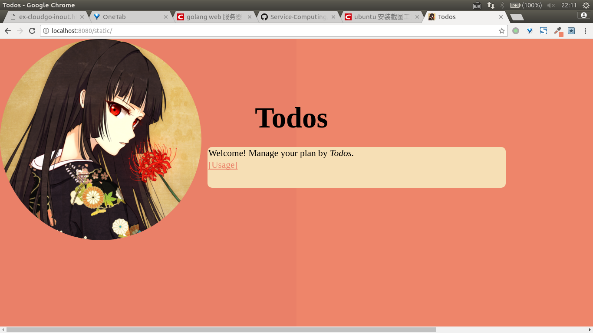
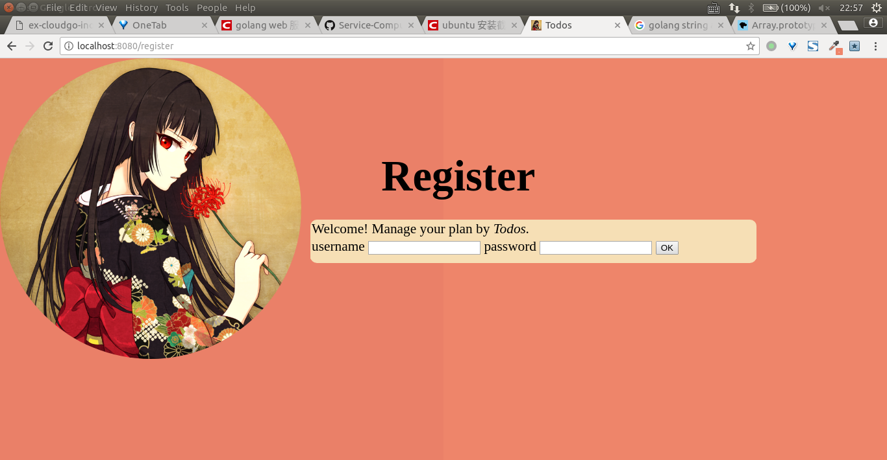
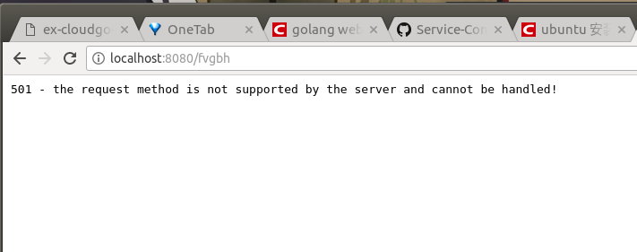
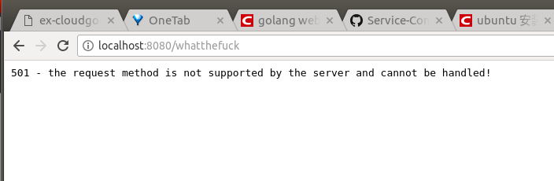
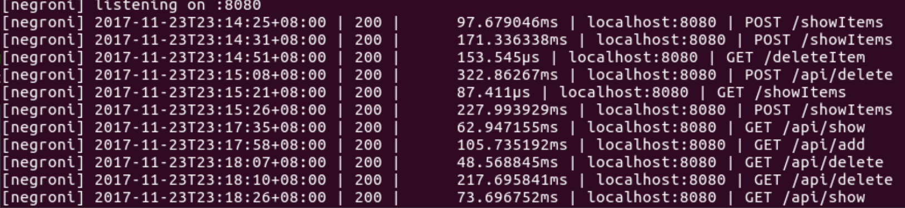
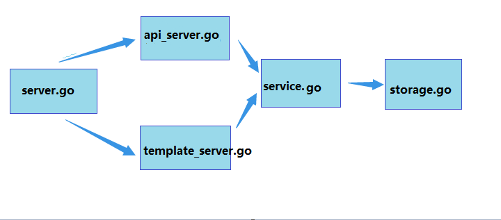

# 处理 web 程序的输入与输出(Todos2.0)

## [基本要求](https://pmlpml.github.io/ServiceComputingOnCloud/ex-services)

简单 web 服务与客户端开发实战

### 1、概述

利用 web 客户端调用远端服务是服务开发本实验的重要内容。其中，要点建立 API First 的开发理念，实现前后端分离，使得团队协作变得更有效率。

**任务目标**

1. 选择合适的 API 风格，实现从接口或资源（领域）建模，到 API 设计的过程
2. 使用 API 工具，编制 API 描述文件，编译生成服务器、客户端原型
3. 使用 Github [建立一个组织](https://chun-ge.github.io/How-to-establish-an-organization-on-Github/)，通过 API 文档，实现 客户端项目 与 RESTful 服务项目同步开发
4. 使用 API 设计工具提供 Mock 服务，两个团队独立测试 API  
5. 使用 travis 测试相关模块

### 2、xx 开发项目

1. 这个是一个团队项目，团队规模不限（建议 6 人以内）
    - 必须使用一个 github 组织管理你的项目仓库
    - 一个仓库是客户端项目，**必须** 使用富客户端js框架。建议框架包括（[VUE.js](https://cn.vuejs.org/),[Angular](https://angular.cn/features),[React](https://reactjs.org/)）
    - 一个仓库是服务端项目，你可以选择 RPC 风格、REST 风格、 GraphQL 构建服务
    - 一个仓库是项目文档，用户通过 git page 了解你的项目
2. 你可以自由选择项目，以下是一些建议：
    - 复制 https://swapi.co/ 网站
        - 你需要想办法获取该网站所有资源与数据
        - 你需要考虑部分资源的授权访问，以满足本作业的要求
    - 自己选择一个项目，如“极简博客”
        - 资源类型不能少于 4 个。 如 “极简博客” 包括， users，acticles, reviews, tags
        - 数据来源必须真实（请选择自己喜欢的网站抓取），每类资源不能少于 4 个数据
        - 只有登陆用户可以发布文章，登陆用户才能发表评论
3. 项目的要求
    - 开发周期
        - 2 周
    - 每个项目仓库必须要有的文档
        - README.md
        - LICENSE
    - 客户界面与美术
        - 没要求，能用就好
    - API 设计
        - API 必须规范，请在项目文档部分给出一个简洁的说明，参考 github v3 或 v4 overview
        - 选择 1-2 个 API 作为实例写在项目文档，文档格式标准，参考 github v3 或 v4
    - 资源来源
        - 必须是真实数据，可以从公共网站获取
        - 在项目文档中，**务必注明资源来源**
    - 服务器端数据库支持
        - 数据库 **只能使用 boltDB**，请 *不要使用 mysql 或 postgre 或 其他*
    - 页面数与 API 数限制
        - 界面不能少于 3 个界面
        - 服务 API 不能少于 6 个
    - API 要求
        - API root 能获取服务列表
        - 部分资源必须授权服务（必须支持授权服务）
        - 支持分页
        - 支持 jsonp 输出 （仅 REST 服务）
    - **加分项**
        - 使用 GraphQL 搞定！
4. 提交物要求
    - 每个团队需要提供项目文档首页的 URL。在文档中包含前后端安装指南。
        - 前端一般使用 npm 安装
        - 后端使用 go get 安装
    - 每个队员必须提交一个相关的博客，或项目小结（请用markdown编写，存放在文档仓库中）
5. 认证技术提示
    - 为了方便实现用户认证，建议采用 JWT 产生 token 实现用户认证。
    - 什么是 jwt？ 官网：https://jwt.io/ 中文支持：http://jwtio.com/
    - 如何使用 jwt 签发用户 token ，用户验证  http://jwtio.com/introduction.html
    - 各种语言工具 http://jwtio.com/index.html#debugger-io
    - 案例研究：[基于 Token 的身份验证：JSON Web Token](https://ninghao.net/blog/2834)

---

## 关于代码(Todos2.0)

+ 本次作业代码是在[上次作业代码](https://github.com/owtotwo/Service-Computing-On-Cloud-Course/tree/homework5)的基础上完成，程序的功能为：用户可用账号密码进行增删查看自己的todolist，功能和用法基本不变，但是用boltDB替代了sqlite3。

+ 代码获取和配置

> $ go get github.com/owtotwo/Service-Computing-On-Cloud-Course/tree/homework6

其他配置参照[Todos1.0](https://github.com/owtotwo/Service-Computing-On-Cloud-Course/tree/homework5/readme.md)，另外还需安装本次作业用到的一些包：

> go get github.com/unrolled/render

> go get github.com/codegangsta/negroni

> go get github.com/gorilla/mux

> go get github.com/boltdb/bolt


## 代码测试

## 支持静态文件服务

像浏览器输入 http://localhost:8080/static/ 获取静态文件服务



可获取Todos的用法

## 支持简单 js 访问  

+ json返回格式：
```
{
  "Operation": 操作类型,
  "Username": 用户名,
  "Todos": todos列表（只有在show时才非空）,
  "Result": 操作成功与否,
  "Message": 操作结果的详细信息
}
```

+ 进行注册：


注册的用户名不能重复：


+ 增加todo项

输入的用户名或密码为空


用户名或密码错误


操作成功


+ 查看所有的todo项


+ 删除todo项

itemIndex是要删除的todos项的序号(大于0，小于todos项总数)，只能为数字

非法itemIndex


删除成功并查看删除后的效果


## 提交表单，并输出一个表格

在浏览器输入url获取模板文件，提交表单后获取服务器处理结果。

"/register" "/addItem" "/deleteItem"三个url均是使用ajax来进行异步请求，通过api提交表单，获取服务器返回的信息，并且局部刷新页面，显示出操作结果信息。

"/showItems"是通过html的input标签向服务器post，刷新整个页面来显示操作结果信息。

+ 注册界面



提交表单后得到注册结果


+ 增加todos项


查看所有的todos项


+ 删除todos项


再次查看todos项


## 对 /unknown 给出开发中的提示，返回码 5xx

在程序中都是以501作为状态码返回





## 其他

+ 数据库的用户ID使用UUID生成，用户密码进行MD5加密

  

+ 浏览器上显示的页面除了static外其他都使用了http/template模板

+ 程序运行过程中服务器的输出截图
  
  

### At last, thanks for reviewing my code!

---

+ 本次作业的代码结构如下：



上一层调用下一层，不越级:

main.go调用server.go提供的接口

server负责初始化路由

api\_server处理api访问的handle函数，template\_server处理浏览器html页面访问的handle函数

service负责对客户端发送过来的请求参数进行逻辑处理

storage负责根据service处理的结果对数据库进行操作

---

## 博客之后补充...