# 开发简单CLI程序

`2018-10-01`

## 作业要求

使用 golang 实现 [开发 Linux 命令行实用程序](https://www.ibm.com/developerworks/cn/linux/shell/clutil/index.html) 中的 **selpg** 。

要求（提示）：

1. 请按文档 **使用 selpg** 章节要求测试你的程序。
2. 请使用 pflag 替代 goflag 以满足 Unix 命令行规范， 参考：[Golang之使用Flag和Pflag](https://o-my-chenjian.com/2017/09/20/Using-Flag-And-Pflag-With-Golang/) 。
3. golang 文件读写、读环境变量，请自己查 os 包。
4. “-dXXX” 实现，请自己查 `os/exec` 库，例如案例 [Command](https://godoc.org/os/exec#example-Command)，管理子进程的标准输入和输出通常使用 `io.Pipe`，具体案例见 [Pipe](https://godoc.org/io#Pipe) 。

## 代码实现

[selpg.go](./selpg/selpg.go) 

### 实现思路

不需要自己整理思路，因为Go也有命令式语言的特性，并且 [开发 Linux 命令行实用程序](https://www.ibm.com/developerworks/cn/linux/shell/clutil/index.html) 一文中有提供 C语言版的selpg（ [selpg.c ](https://www.ibm.com/developerworks/cn/linux/shell/clutil/selpg.c) ），而且详细地描述了 selpg 程序逻辑，照着写即可。

## 效果测试

测试工具用到Ubuntu自带的虚拟PDF打印机 [PDF printer for CUPS](https://apps.ubuntu.com/cat/applications/lucid/cups-pdf/) （因为没有实体打印机，听前辈说可以用这个）。

然后自己生成了两个测试文本文件，分别是用分页符 (`'\f'`) 和换行符 (`'\n'`) 分割。

### 参数说明

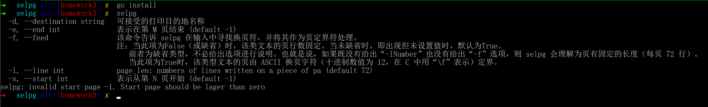

### 测试样例

#### 作为参数输入
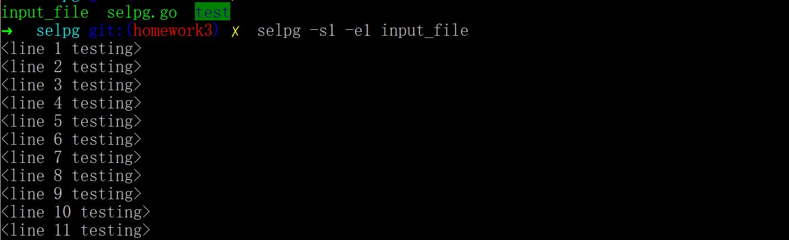
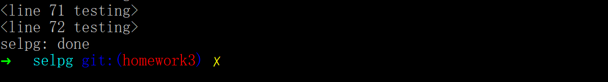

#### 标准输入
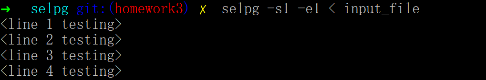


#### 管道输入
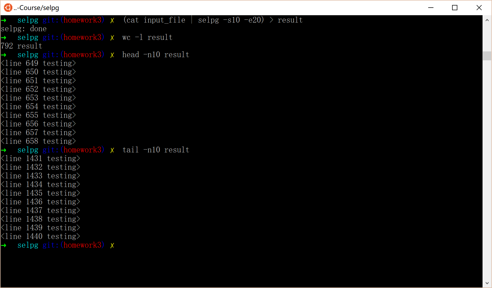

#### 标准错误输出
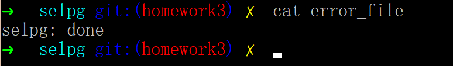

#### 其他的关于重定向的
都一样，一个意思，标准输出和标准错误输出和标准输入的问题而已。（ `/dev/null` 为黑洞）

#### 同时作为管道输入加输出
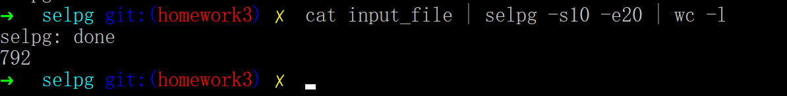

#### 参数 -l
一页66行所以总行数当然就少了 `(20 - 10 + 1) * (72 - 66) = 66` 行了。
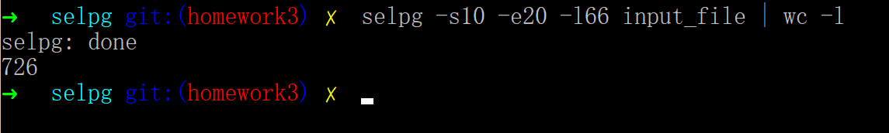

#### 参数 -f

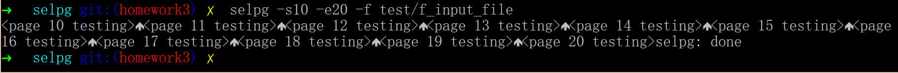

#### 参数 -d

```bash
$ selpg -s10 -e20 -l20 -dPDF data/l_input_file
```

在[PDF printer for CUPS](https://apps.ubuntu.com/cat/applications/lucid/cups-pdf/)生成文件的文件夹下，我们可以找到打印出来的pdf文件： 

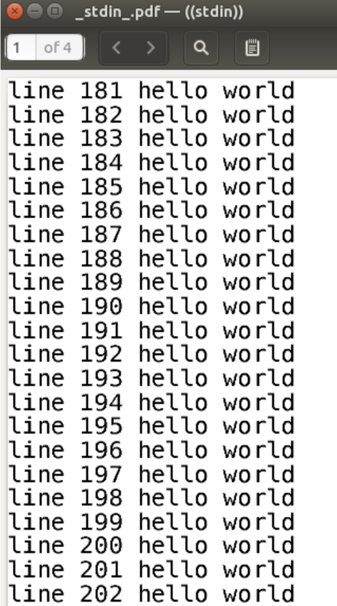

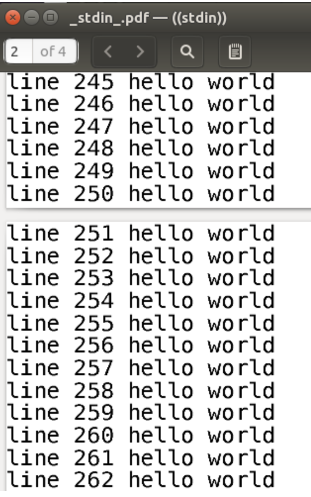

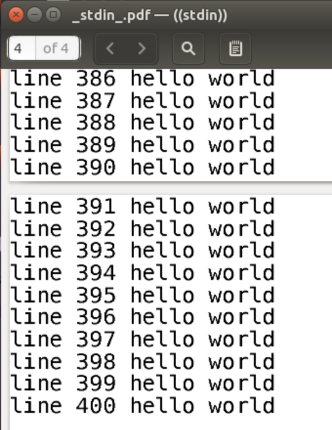

从第10页181行开始打印到最后20页第最后一行400行，符合预期。


## （完）


