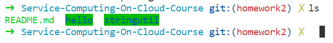

# 关于安装 Golang 开发环境的一些内容

`2018-09-20`

## 前言

（每次的前言都一样，因为我觉得很重要）

首先我先表明自己的观点，博客的质量与其篇章长度、图片数量、事无巨细的表述没有必然联系。

课程博客我一般分两种。一种是笔记型的，属于自己把课程作业的流程记录下来为主，也顺便帮其他同学跳坑；另一种是分享型的，一般是把自己获得的新知识或别人可能接触得比较少的知识给列出来，开阔新视界。至于那种自己的创新技术或研发的新型框架等内容，单独分出来吧，这时候博客只是一种叙述形式，github开源代码、发paper也是好的形式，当然这对于课程而言要求就高了点了。

那既然上次是分享型的，这次的学习内容与博客要求内容偏向于笔记型，那么这次就做一次笔记吧。

## 安装Go语言环境

每次都要与众不同一点……所以这次我没有在Windows上装，也没有在macOS上装，也没有在CentOS或者其他桌面发行版上装，也没有在之前搭建好的服务器节点上装（其实装了，因为顺手装了docker）—— 这次我选择在WSL上装。

## WSL（Windows Subsystem for Linux）

这东西估计很多人见过，但是都是在它刚出来的时候用过一下，发现bug太多（单纯就字符编码bug就各种问题），大家应该都弃用了。但是现在Windows 10版本已经到达1803了，WSL已经相对完善，经过一系列的体验，已经基本可以用于生产。

 

微软商店有几个不同的基于WSL创建的发行版，为了方便方便我选了第一个。

 

到现在来说已经有Ubuntu18.04 LTS最新的稳定版出来了，大家可以使用。（桌面版的建议暂时使用旧的稳定版，因为新的很多东西都不太稳定，比如输入法。）

Ubuntu 18.04 (on Windows) 安装go语言开发环境

替换apt源这一步就不多说了，不是主要内容，放上链接即可：[清华大学开源软件镜像站 - Ubuntu 镜像使用帮助](https://mirrors.tuna.tsinghua.edu.cn/help/ubuntu/)。（当然中科大的也很好用）

顺便可以装个shell好看一点（zsh + [oh-my-zsh](https://github.com/robbyrussell/oh-my-zsh)）：


先更新一下源列表：

> $ sudo apt update

一段时间后好了，可以装golang了：

> $ sudo apt install golang

完事儿了，看看成功没：

> $ go version

应该能看到版本内容：


配置环境在 `~/.profile` 文件尾中添加: 

``` shell
# 挂载Win10的D盘路径
export DDISK=/mnt/d
# 设置GOPATH
export GOPATH=$DDISK/gowork
# 设置系统环境路径可直接访问Go的二进制可执行文件
export PATH=$PATH:$GOPATH/bin
```

先执行以下更改，使其生效：

> $ source ~/.profile

对于很多人不懂一堆东西的区别：`.profile`, `.bashrc`, `.bash_profile`, `.zshrc`, `.vimrc`......

看看这里吧，简短：[~/.profile ~/.bashrc和~./bash_profile的理解以及zsh的使用](https://www.jianshu.com/p/b39fd35e2360)。

创建Go的工作空间路径，也就是GoPath文件夹：

> $ mkdir $GOPATH -p

## 创建Hello World！

这个就可能稍微没有那么直观，因为我这样装Go环境的话，其实就是Go的编译执行环境和包管理安装环境都是在Linux amd64的架构下，但只有编辑代码或者编辑文件内容是在Windows下的。你可以选择使用Sublime、Visual Studio Code、Atom，任君选择。

我选择VSCode：

直接打开GOPATH对应的文件夹，就可以编辑了。

依据[如何使用Go编程](https://go-zh.org/doc/code.html)编辑好hello/hello.go和stringutil/stringutil.go和stringutil/stringutil_test.go三个文件后，并执行相应的命令：




当前的项目结构：


> $ go get github.com/golang/example/hello


再看现在的结构：


其实`go get something`做的就是远程拉库下来并且进行`go install`。（简单来说）

### 关于Go与Git远程仓库间的交互

其实我的这个[readme](./README.md)就是在go的自己的某一个项目结构下，所以代码对应的也会push到相应的分支上，作为此次作业的仓库分支。

## 作业相关

[Git的个人心得](./git_manual.md)

## 结语

应该差不多了，内容算是够，也有点新意，还阔以吧。
