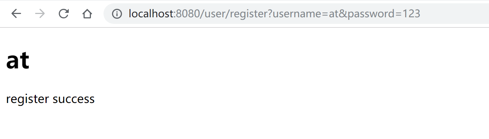
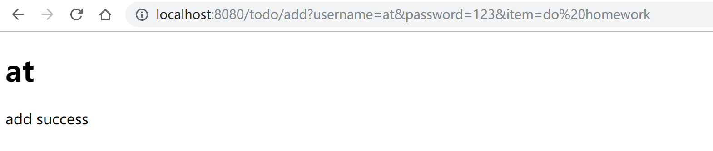
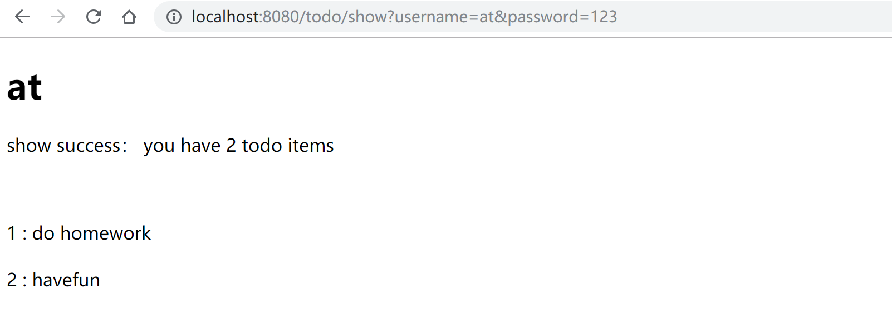
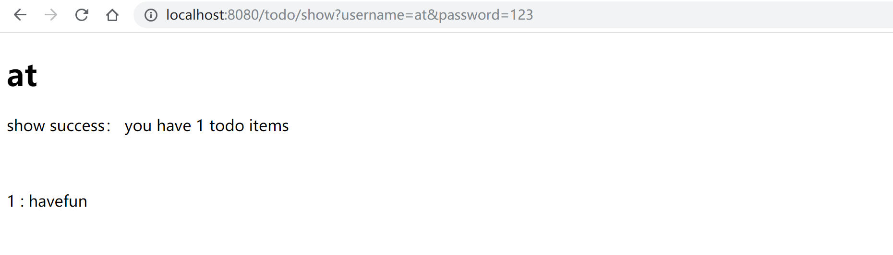

# 开发 web 服务程序 - Todolist

## Task requirements

1. 熟悉 go 服务器工作原理

2. 基于现有 web 库，编写一个简单 web 应用类似 cloudgo

3. 使用 curl 工具访问 web 程序

4. 对 web 执行压力测试

The task requirements is from [ex-cloudgo-start](https://pmlpml.github.io/ServiceComputingOnCloud/ex-cloudgo-start)

In order to know golang web better, I **didn't use any frame** in this homework 

（并没有用框架）

## About Todos

This program easy to use can help people to record what they need to do in a simple way.

Users just type URL into their browser or enter command at the command line. 

There are only four command for using totally. 

The data of users are saved in database stored on the server so users should be online when using this tools. 

User should register by username and password. 

User can add, delete and show the todolist with username and password.

## Install

Before running this program, please make sure that you have installed the following tools.

+ golang

+ sqlite3

+ sqlite3 database driver

    [go-sqlite3](https://github.com/mattn/go-sqlite3) is a database driver of the program.

    > $ go get github.com/mattn/go-sqlite3

Run the program

+ Get the program

    > $ mkdir -p $GOPATH/src/github.com/owtotwo/Service-Computing-On-Cloud-Course
    > $ cd $GOPATH/src/github.com/owtotwo/Service-Computing-On-Cloud-Course
    > $ git clone https://github.com/owtotwo/Service-Computing-On-Cloud-Course
    > $ git checkout homework5
    > $ go install github.com/owtotwo/Service-Computing-On-Cloud-Course
    > $ Service-Computing-On-Cloud-Course

The default port is 8080:

> $ hw3

``` text
2017/11/08 20:58:25 [Todos]  port 8080 is listening

...
```

Or the port can be seted by:

> $ hw3 -p 9090

``` text
2017/11/08 20:58:25 [Todos]  port 9090 is listening

...
```

End the program by _Ctrl + C_

## Usage and Curl Testing

+ Register as a user

  + The register URL format is: user/registe?username=XXX&password=XXX

  + You can type URL into browser:

  >  http://localhost:8080/user/register?username=at&password=123

  

  Or you can enter on the command line:

  > $ curl -4 -v  http://localhost:8080/user/register?username=at\&password=123

  ``` text
  *   Trying 127.0.0.1...
  * TCP_NODELAY set
  * Connected to localhost (127.0.0.1) port 8080 (#0)
  > GET /user/register?username=at&password=123 HTTP/1.1
  > Host: localhost:8080
  > User-Agent: curl/7.58.0
  > Accept: */*
  >
  < HTTP/1.1 200 OK
  < Date: Fri, 16 Nov 2018 15:30:48 GMT
  < Content-Length: 135
  < Content-Type: text/html; charset=utf-8
  <
  <!DOCTYPE html>
  <html>

  <head>
      <title>Todos</title>
  </head>

  <body>
      <h1>at</h1>

      <p>register success</p>
  </body>

  </html>
  * Connection #0 to host localhost left intact
  ```

  + If you type empty username or password, you will receive a error message:

  > $  curl -4 -v http://localhost:8080/user/register\?username\=\&password\=123

  ``` text
  *   Trying 127.0.0.1...
  * TCP_NODELAY set
  * Connected to localhost (127.0.0.1) port 8080 (#0)
  > GET /user/register?username=&password=123 HTTP/1.1
  > Host: localhost:8080
  > User-Agent: curl/7.58.0
  > Accept: */*
  >
  < HTTP/1.1 200 OK
  < Date: Fri, 16 Nov 2018 15:51:56 GMT
  < Content-Length: 157
  < Content-Type: text/html; charset=utf-8
  <
  <!DOCTYPE html>
  <html>

  <head>
      <title>Todos</title>
  </head>

  <body>
      <h1></h1>

      <p>username and password should be non-empty</p>
  </body>

  </html>
  * Connection #0 to host localhost left intact
  ```

  + If you register twice with the same username, you will receive errors:

  > $ curl -4 -v http://localhost:8080/user/register\?username\=at\&password\=123

  ``` text
  *   Trying 127.0.0.1...
  * TCP_NODELAY set
  * Connected to localhost (127.0.0.1) port 8080 (#0)
  > GET /user/register?username=at&password=123 HTTP/1.1
  > Host: localhost:8080
  > User-Agent: curl/7.58.0
  > Accept: */*
  >
  < HTTP/1.1 200 OK
  < Date: Fri, 16 Nov 2018 15:54:30 GMT
  < Content-Length: 164
  < Content-Type: text/html; charset=utf-8
  <
  <!DOCTYPE html>
  <html>

  <head>
      <title>Todos</title>
  </head>

  <body>
      <h1>at</h1>

      <p>register fail: the username may have been used</p>
  </body>

  </html>
  * Connection #0 to host localhost left intact
  ```

  + Or, if you type invalid URL, you may get a 404 page:

  > $ curl -4 -v http://localhost:8080/user/regi

  ``` text
  *   Trying 127.0.0.1...
  * TCP_NODELAY set
  * Connected to localhost (127.0.0.1) port 8080 (#0)
  > GET /user/regi HTTP/1.1
  > Host: localhost:8080
  > User-Agent: curl/7.58.0
  > Accept: */*
  >
  < HTTP/1.1 404 Not Found
  < Content-Type: text/plain; charset=utf-8
  < X-Content-Type-Options: nosniff
  < Date: Fri, 16 Nov 2018 15:55:34 GMT
  < Content-Length: 19
  <
  404 page not found
  * Connection #0 to host localhost left intact
  ```

+ Add todo item

  + The add URL format is: todo/add?username=XXX&password=XXX&item=XXX

  + You can type URL into browser:

    >  http://localhost:8080/todo/add?username=at&password=123&item=do homework

    

    Or you can enter on the command line:

    > $ curl -4 -v http://localhost:8080/todo/add?username=at\&password=123\&item=havefun

    ``` text
    *   Trying 127.0.0.1...
    * TCP_NODELAY set
    * Connected to localhost (127.0.0.1) port 8080 (#0)
    > GET /todo/add?username=at&password=123&item=havefun HTTP/1.1
    > Host: localhost:8080
    > User-Agent: curl/7.58.0
    > Accept: */*
    >
    < HTTP/1.1 200 OK
    < Date: Fri, 16 Nov 2018 16:15:30 GMT
    < Content-Length: 129
    < Content-Type: text/html; charset=utf-8
    <
    <!DOCTYPE html>
    <html>

    <head>
        <title>Todos</title>
    </head>

    <body>
        <h1>at</h1>

        <p>add success</p>
    </body>

    </html>
    * Connection #0 to host localhost left intact
    ```

  + If you type empty item:

    > $ curl -4 -v http://localhost:8080/todo/add?username=at\&password=123\&item=

    ``` text
    *   Trying 127.0.0.1...
    * TCP_NODELAY set
    * Connected to localhost (127.0.0.1) port 8080 (#0)
    > GET /todo/add?username=at&password=123&item= HTTP/1.1
    > Host: localhost:8080
    > User-Agent: curl/7.58.0
    > Accept: */*
    >
    < HTTP/1.1 200 OK
    < Date: Fri, 16 Nov 2018 16:16:38 GMT
    < Content-Length: 195
    < Content-Type: text/html; charset=utf-8
    <
    <!DOCTYPE html>
    <html>

    <head>
        <title>Todos</title>
    </head>

    <body>
        <h1>at</h1>

        <p>add fail: please check username and password and the item should be non-empty</p>
    </body>

    </html>
    * Connection #0 to host localhost left intact
    ```

+ Show all todo items

  + The show URL format is: todo/show?username=XXX&password=XXX

  + You can type URL into browser:

  >  http://localhost:8080/todo/show?username=at&password=123

  

  Or you can enter on the command line:

  > $ curl -4 -v http://localhost:8080/todo/show?username=at\&password=123

  ``` text
  *   Trying 127.0.0.1...
  * TCP_NODELAY set
  * Connected to localhost (127.0.0.1) port 8080 (#0)
  > GET /todo/show?username=at&password=123 HTTP/1.1
  > Host: localhost:8080
  > User-Agent: curl/7.58.0
  > Accept: */*
  >
  < HTTP/1.1 200 OK
  < Date: Fri, 16 Nov 2018 16:21:45 GMT
  < Content-Length: 261
  < Content-Type: text/html; charset=utf-8
  <
  <!DOCTYPE html>
  <html>

  <head>
      <title>Todos</title>
  </head>

  <body>
      <h1>at</h1>

      <p>show success： you have 2 todo items</p>

      <div>
            <br /><br />   1 : do homework  <br /><br />   2 : havefun  <br /><br />
      </div>
  </body>

  </html>
  * Connection #0 to host localhost left intact
  ```

+ Delete todo item

  + The delete URL format is: todo/delete?username=XXX&password=XXX&index=XXX

  + You can type URL into browser to delete the second item:

  >  http://localhost:8080/todo/delete?username=at&password=123&index=1

  

  And show todolist after deleting:

  

  Or you can enter on the command line:

  > $ curl -4 -v http://localhost:8080/todo/delete?username=at\&password=123\&index=1

  ``` text
  *   Trying 127.0.0.1...
  * TCP_NODELAY set
  * Connected to localhost (127.0.0.1) port 8080 (#0)
  > GET /todo/delete?username=at&password=123&index=1 HTTP/1.1
  > Host: localhost:8080
  > User-Agent: curl/7.58.0
  > Accept: */*
  >
  < HTTP/1.1 200 OK
  < Date: Fri, 16 Nov 2018 16:24:10 GMT
  < Content-Length: 132
  < Content-Type: text/html; charset=utf-8
  <
  <!DOCTYPE html>
  <html>

  <head>
      <title>Todos</title>
  </head>

  <body>
      <h1>at</h1>

      <p>delete success</p>
  </body>

  </html>
  * Connection #0 to host localhost left intact
  ```

  And show all items:

  > $ curl -4 -v http://localhost:8080/todo/show\?username\=at\&password\=123

  ``` text
  *   Trying 127.0.0.1...
  * TCP_NODELAY set
  * Connected to localhost (127.0.0.1) port 8080 (#0)
  > GET /todo/show?username=at&password=123 HTTP/1.1
  > Host: localhost:8080
  > User-Agent: curl/7.58.0
  > Accept: */*
  >
  < HTTP/1.1 200 OK
  < Date: Fri, 16 Nov 2018 16:26:36 GMT
  < Content-Length: 201
  < Content-Type: text/html; charset=utf-8
  <
  <!DOCTYPE html>
  <html>

  <head>
      <title>Todos</title>
  </head>

  <body>
      <h1>at</h1>

      <p>show success： you have 0 todo items</p>

      <div>
            <br /><br />
      </div>
  </body>

  </html>
  * Connection #0 to host localhost left intact
  ```

  If you type invalid itemIndex such as non-numeric string, less than one or larger than todolist size, you may get error tips:

  > $ curl -4 -v http://localhost:8080/todo/delete?username=at\&password=123\&index=0

  ``` text
  *   Trying 127.0.0.1...
  * TCP_NODELAY set
  * Connected to localhost (127.0.0.1) port 8080 (#0)
  > GET /todo/delete?username=at&password=123&index=0 HTTP/1.1
  > Host: localhost:8080
  > User-Agent: curl/7.58.0
  > Accept: */*
  >
  < HTTP/1.1 200 OK
  < Date: Fri, 16 Nov 2018 16:30:45 GMT
  < Content-Length: 200
  < Content-Type: text/html; charset=utf-8
  <
  <!DOCTYPE html>
  <html>

  <head>
      <title>Todos</title>
  </head>

  <body>
      <h1>at</h1>

      <p>delete fail: please check username and password and the item index should be valid</p>
  </body>

  </html>
  * Connection #0 to host localhost left intact
  ```

+ Server will show some information about the requests:

  ``` text
  2018/11/17 00:12:08 [Todos]  port 8080 is listening
  2018/11/17 00:12:10 [Todos]  GET | 200 | register
  2018/11/17 00:17:44 [Todos]  GET | 200 | register
  2018/11/17 00:22:12 [Todos]  GET | 200 | register
  2018/11/17 00:22:34 [Todos]  GET | 200 | register
  2018/11/17 00:27:58 [Todos]  GET | 400
  2018/11/17 00:32:52 [Todos]  GET | 200 | register
  2018/11/17 00:33:49 [Todos]  GET | 200 | register
  2018/11/17 00:34:08 [Todos]  GET | 200 | add
  2018/11/17 00:34:14 [Todos]  GET | 200 | add
  2018/11/17 00:34:15 [Todos]  GET | 200 | register
  2018/11/17 00:34:24 [Todos]  GET | 200 | register
  2018/11/17 00:42:56 [Todos]  GET | 200 | show
  2018/11/17 00:44:24 [Todos]  GET | 200 | add
  2018/11/17 00:44:35 [Todos]  GET | 200 | add
  2018/11/17 00:45:49 [Todos]  GET | 200 | add
  2018/11/17 00:46:48 [Todos]  GET | 400
  2018/11/17 00:48:40 [Todos]  GET | 200 | show
  2018/11/17 00:48:52 [Todos]  GET | 200 | show
  2018/11/17 00:52:30 [Todos]  GET | 200 | delete
  2018/11/17 00:53:10 [Todos]  GET | 200 | show
  2018/11/17 00:54:48 [Todos]  GET | 200 | delete
  2018/11/17 01:03:16 [Todos]  GET | 200 | show
  2018/11/17 01:03:21 [Todos]  GET | 200 | show
  2018/11/17 01:03:30 [Todos]  GET | 200 | delete
  ...
  ```

## ab Testing

For the database connection has the max connection number, the server will report errors if requests are too much. So I test my program using URL that has nothing about SQL.

commonly used parameters:

+ -n means the numbers of all requests
+ -c means the numbers of requests in one time and the default number is 1

I test my web program by 10000 requests and 1000 requests one time(that is 1000 users).

> $ ab -n 10000 -c 1000 http://localhost:8080/user/register?username=

This is the ab-test result, I write some Chinese comments in it by "#":

```
This is ApacheBench, Version 2.3 <$Revision: 1706008 $>
Copyright 1996 Adam Twiss, Zeus Technology Ltd, http://www.zeustech.net/
Licensed to The Apache Software Foundation, http://www.apache.org/

Benchmarking localhost (be patient)
Completed 1000 requests
Completed 2000 requests
Completed 3000 requests
Completed 4000 requests
Completed 5000 requests
Completed 6000 requests
Completed 7000 requests
Completed 8000 requests
Completed 9000 requests
Completed 10000 requests
Finished 10000 requests


Server Software:
Server Hostname:        localhost   # 服务器主机
Server Port:            8080        # 服务器端口

Document Path:          /user/register?username=
Document Length:        156 bytes   # 测试的页面文档长度

Concurrency Level:      1000        # 并发用户数，即-c参数指定的数量
Time taken for tests:   0.848 seconds   # 测试总用时
Complete requests:      10000       # 测试完成的请求数量
Failed requests:        0           # 测试失败的请求数量
Total transferred:      2730000 bytes   # 响应数据长度总和
HTML transferred:       1560000 bytes   # html内容长度
Requests per second:    12792.94 [#/sec] (mean) # 每秒请求数量
Time per request:       84.796 [ms] (mean)      # 平均请求响应时间
Time per request:       0.087 [ms] (mean, across all concurrent requests)   # 每个请求实际运行的平均时间
Transfer rate:          3134.12 [Kbytes/sec] received   # 平均每秒网络流量，帮助排除网络流量过大导致响应时间延长的可能

Connection Times (ms)   # 网络消耗时间的组成
              min  mean[+/-sd] median   max
Connect:        0   13   8.7     11      39
Processing:     3   38  18.6     33     253
Waiting:        0   34  18.4     29     248
Total:          4   51  21.3     48     261

Percentage of the requests served within a certain time (ms)
  50%     48    # 50% 的用户请求在48ms内完成，后面的类似
  66%     59
  75%     63
  80%     66
  90%     80
  95%     96
  98%    104
  99%    109
 100%    261 (longest request)
```

## At last, IG nb
